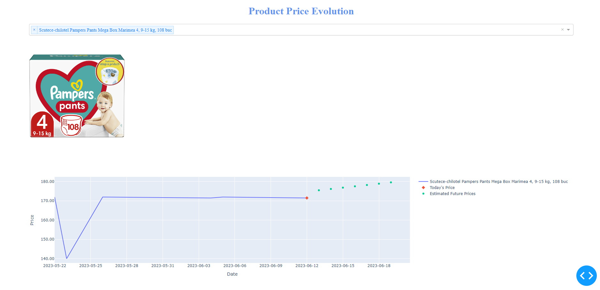
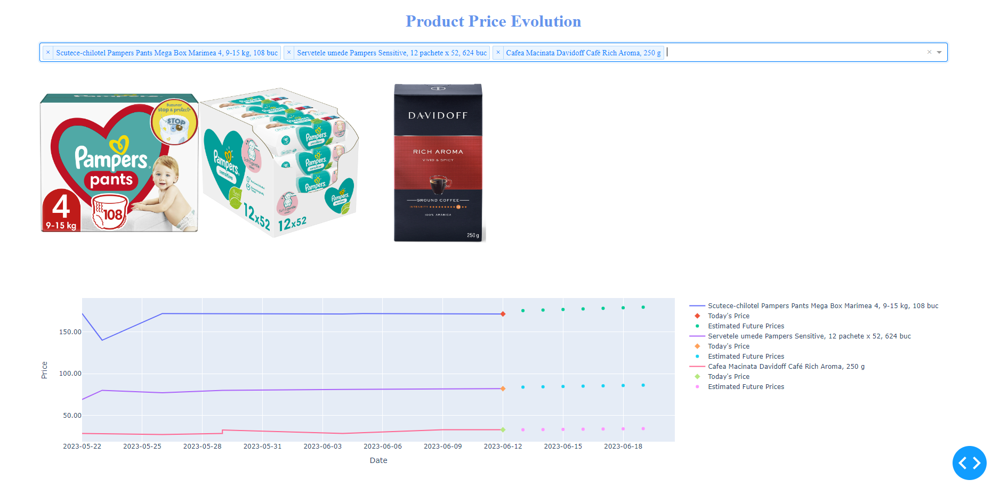

# Price Scraper 
Project simulating scraping some webpages to get data for personal shopping
by taking into account the past prices and attempting to integrate a price prediction.

## Table of Contents

- [About](#about)
- [Technologies](#technologies)
- [Get started](#get_started)
- [Installing](#installing)
- [Usage](#usage)
- [API](#api)
- [Acknowledgements](#acknowledgements)

## About

The app scrapes urls from mongoDB and inserts products in the db if they do not exist.
If the products already exist in the collection, we check if the image link is different or if the price has changed.
In both cases, the data is updated.
After the database is populated/updated, the uvicorn server is started and the endpoints
endpoints can be accessed to manipulate data.
For viewing data, we can run dash_pages/price_history.py to see the prices and dates 
on the chart, together with the image and estimated future price. Dropdown list with
multi options available. For testing purposes, I used links from emag website.

## Technologies
python = "^3.10"  -->undetected-chromedriver working on python 3.10.5 without issues . Encountered issues like OSError: [WinError 6] The handle is invalid when using 3.11  
selenium = "^4.9.1"  
pymongo = "^4.3.3"  
undetected-chromedriver = "^3.4.7"  
pydantic = "^1.10.7"  
fastapi = "^0.95.2"  
uvicorn = "^0.22.0"  
dash = "^2.10.0"  
plotly = "^5.14.1"  
dash-bootstrap-components = "^1.4.1"  
numpy = "^1.24.3"  
sklearn = "^0.0.post5"  
scikit-learn = "^1.2.2"  
dash-html-components = "^2.0.0"  
dash-core-components = "^2.0.0"  
gunicorn = "^20.1.0"  
setuptools = "^67.8.0"  
MongoDB

## Get_started
!!! undetected-chromedriver working on python 3.10.5 without issues . Encountered issues like <OSError: [WinError 6] The handle is invalid> when using 3.11  
1. The code assumes the database in mongo is already created: 'web_scraper'
2. Create the collection 'urls' with field 'link' and manually add the weblink. 
Add as many links as you want. Or simply uncomment the lines from main.py related to
adding urls from a given list with your urls.
3. Mongo is running on default URI "mongodb://localhost:27017"

## Installing
Install the project dependencies from the toml file.

## Usage
- main.py   

-> to run the app locally in the terminal
uvicorn.run(app, host="127.0.0.1", port=5000, log_level="info")  

-> for local usage: in database.client --> cls._instance.client = MongoClient("mongodb://localhost:27017")  
'products': cls._instance.client["web_scraper"]["products"]
'urls': cls._instance.client["web_scraper"]["urls"]

- price_history.py
-> works on http://127.0.0.1:8050/dash/

## API
API available for products with FastAPI.
The documentation is automatically generated by fastapi and is available at ({localhost:port}/docs).
Ex: http://127.0.0.1:5000/docs

API structure:  
{{host}}/products - to create  
{{host}}/products/646bc3e359d4e7b60f3f0a15 - to update: using obj_id  
{{host}}/products/646db4135621a4795774175b - to delete: using obj_id  
{{host}}/products/123/history - for history: using sku  
{{host}}/products/123 - to read : using sku  
{{host}}/products?page=1&per_page=10 - to list with pagination  

## Acknowledgements
Many thanks to Alexandru Niculae from Nenos Academy for his feedback and guidance.